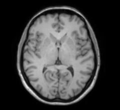
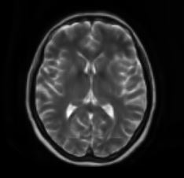
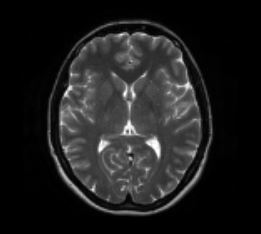

# 3D-CycleGan-Pytorch-Medical-Imaging-Translation

Pytorch pipeline for 3D image domain translation using Cycle-Generative-Adversarial-networks, without paired examples.  
*******************************************************************************
## Requirements
We download the official MONAI DockerHub, with the latest MONAI version. Please visit https://docs.monai.io/en/latest/installation.html

Additional packages can be installed with "pip install -r requirements.txt"
*******************************************************************************
## Python scripts and their function

- organize_folder_structure.py: Organize the data in the folder structure (training,testing) for the network.

- check_loader_patches: Shows example of patches fed to the network during the training.

- options_folder/base_options.py: List of base_options used to train/test the network.  

- options_folder/train_options.py: List of specific options used to train the network.

- options_folder/test_options.py: List of options used to test the network.

- models_folder: the folder contains the scripts with the networks and the cycle-gan training architecture.

- train.py: Runs the training. (Set the base/train options first)

- test.py: It launches the inference on a single input image chosen by the user. (Set the base/train options first)
*******************************************************************************
## Usage
### Folders structure:

Use first "organize_folder_structure.py" to create organize the data.
Modify the input parameters to select the two folders: images and labels folders with the dataset.
(Example, I want to obtain T2 from T1 brain images)

    .
	├── Data_folder                   
	|   ├── T1_Brain               
	|   |   ├── image1.nii 
    |   |   ├── image2.nii 	
	|   |   └── image3.nii                     
	|   ├── T2_Brain                        
	|   |   ├── image1.nii 
    |   |   ├── image2.nii 	
	|   |   └── image3.nii  

Data structure after running it:

	.
	├── Data_folder                   
	|   ├── train              
	|   |   ├── images (T1)            
	|   |   |   ├── 0.nii              
	|   |   |   └── 1.nii                     
	|   |   └── labels (T2)            
	|   |   |   ├── 0.nii             
	|   |   |   └── 1.nii
	|   ├── test              
	|   |   ├── images (T1)           
	|   |   |   ├── 0.nii              
	|   |   |   └── 1.nii                     
	|   |   └── labels (T2)            
	|   |   |   ├── 0.nii             
	|   |   |   └── 1.nii
	
To make the training work it is necessary that the train images and labels have same matrix size and same origin/direction, because the program extracts image patches with the
SimpleITK functions (or take the all image if you set the same size). Also the augmentations are done with SimpleITK. By using the IXI-brain-Dataset, I registered all data to
a reference image with a registration script (Applied first Sobel and then affine registration) in organize_folder_structure.py. It's not necessary that all source and target 
images are perfectly overlaid, the network will learn anyway the distributions if the patch_size is large to have enough spatial information.
*******************************************************************************
### Training:
- Modify the options to set the parameters and start the training/testing on the data. Read the descriptions for each parameter.
- Afterwards launch the train.py for training. Tensorboard is not available to monitor the training: you have to stop the training to test the checkpoints weights. You can continue the training
by loading them and setting the correspondent epoch.
*******************************************************************************
### Inference:
Launch "test.py" to test the network. Modify the parameters in the test_options parse section to select the path of image to infer and result. First you have to rename the weights "latest_net_GA" in:
"latest_net_G" to go from images (T1) to labels (T2). Do the same with latest_net_GB to go in the opposite direction.

Sample images: on the left side the T1, in the middle the T2_fake and the right side the T2

*******************************************************************************
### Tips:
- Use and modify "check_loader_patches.py" to check the loader, try augmentations functions, padding, etc. and see and the patches fed during training. 
- Adapt "Organize_folder_structure.py" depending on you trainig data, before starting the training. Check on 3DSlicer or ITKSnap if your data are correctly pre-processed and have same origin and size.
- I noticed that ResNet works better for image translation and with MSEloss for the Discriminator. You can pick different networks from the Base_options.  

